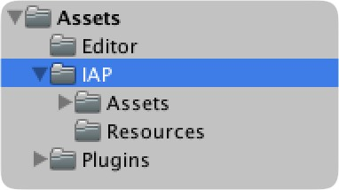
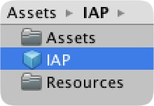
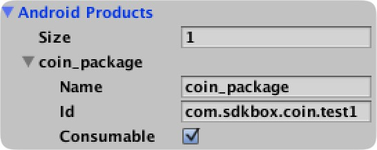
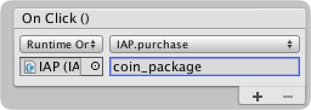

# IAP 插件文档

更多的信息，请访问我们的主页：[www.sdkbox.com](http://cocos2d-x.org/sdkbox)

## 为使用 IAP 插件配置您的 Unity 工程

这部分文档不会包括如何创建 Unity 工程，如何在 iOS 或者 Google 应用商店里创建 app 。关于这些方面的内容，请您参考 iOS 以及 Android 的相关文档。

每个平台下的应用商店识别您的 app 的方式是不同的。在 iOS 平台下，您需要包标识符从应用商店获取 app 项目信息。您可以从您创建 app 的页面，也就是 Apple 开发者中心获取包标识符。包标识符必须设置在 Player 配置中的 iOS 项下。您可以从 [这里](https://developer.apple.com/library/ios/documentation/LanguagesUtilities/Conceptual/iTunesConnectInAppPurchase_Guide/Chapters/Introduction.html#//apple_ref/doc/uid/TP40013727) 获取更多信息。

在 Android 平台下，您需要在配置 IAP 的 inspector pane 中指定一个 key 。您可以从 Google Play 控制台获取这个 key， Google Play 控制台也是您创建 app 以及 app 内购买项目的地方。您可以从 [这里](http://developer.android.com/google/play/billing/billing_overview.html) 获取更多信息。

## 集成 SDKBOX IAP

在开始使用 SDKBOX IAP 之前，需要将 ```skdbox iap``` unity 包导入到您的工程中。这将会在 Assets 目录下创建一个名叫 IAP 的子目录。



这个目录包含了 IAP 插件的所有内容。

然后在 IAP 目录中找到 IAP prefab 。



在您想使用 IAP 的场景中创建一个 IAP prefab 的实例，比如您 app 里的商店场景。

在 hierarchy 中选择 IAP 游戏对象，并且在您的 inspector pane 中您可以配置这个 IAP 对象。

## 指定一个 Key （Android）


在 Android 平台下， 您需要从 Google Play 的开发者控制台 ```Services & APIs``` 项下获取 license key 。拷贝并且粘贴这个 key 到 Android Key 文本框里。

## 添加购买项目

购买项目可以使用 iTunes 或者 Google Play 添加。参考下面的步骤来在 Apple 或者 Google 平台下添加购买项目。

每一种购买项目必须有一个名字，并且有 Consumable 或者 Non-consumable 两种类型可以选择。Google 仅仅支持后一种类型。但是 SDKBOX IAP 插件可以允许您在 Google 平台上支持 Consumable 类型的购买项目，就像在 Apple 平台上一样，其行为也与 Apple 平台上一致。

在每个平台的 ```Products``` 文本框里， 您可以指定购买项目的数目，设置每个购买项目的名字以及它是否是 Consumable 的购买项目。




## 使用 IAP 插件

Making a purchase is as simple as invoking the ```purchase``` method on the IAP game object. There are several ways to do this, we will do it by adding a button.
我们可以简单的调用 IAP 游戏对象的 ```purchase``` 方法进行一次购买。有几种方式来调用这一方式，我们将使用添加一个按钮的方式来展示如何调用这一方法。

从菜单里选择 **Game Object** -> **UI** -> **Button** 。这将创建一个 UI canvas （如果您之前没有创建过的话）并且添加一个按钮。


在 hierarchy 中给您的按钮定义一个名字，并且修改它的文本为诸如“Purchase”之类的词。

然后在 inspector pane 里， 找到 ```On Click()``` 事件并且从对象下拉列表中选择 IAP 游戏对象。然后从方法下拉列表中欧您选择```IAP.purchase``` 方法。

这个方法需要一个字符串类型的参数，用来指定被购买项目的名字。您可以在方法名的空白处输入这个名字。



## 处理回调

当您初始化插件，进行项目购买或者恢复之前购买项目的时候，将会触发回调。

下面列出了这些回调函数和它们的参数。


* ```onInitialized (bool status)``` 将在 IAP 插件初始化之后调用。它的布尔参数说明了之前的初始化成功与否。```true``` 表示成功。

* ```onProductRequestSuccess (Product[] products)``` 将在插件初始化之后，请求应用商店中的购买项目信息成功后被调用。参数数组存放了所有可用的购买项目。

* ```onProductRequestFailure (string error)``` 将在插件初始化之后，请求应用商店中的购买项目信息失败后后被调用。string参数存放了错误信息。

* ```onSuccess (Product product)``` 将在一次成功购买后被调用。参数存放的是购买项目的信息。具体的细节可以参考 ```Product```类型的定义。

* ```onFailure (Product product, string error)``` Called after a failed purchase attempt. The product is supplied as an argument, and a string is passed containing an error message.

* ```onFailure (Product product, string error)``` 将在一次失败购买后被调用。参数 product 存放的是购买项目的信息, string 参数存放错误的内容。

* ```onCanceled (Product product)``` 在一次购买被取消之后调用。参数 product 存放的是购买项目的信息。

* ```onRestored (Product product)``` 在每一个购买项目从商店中恢复时被调用。如果没有购买项目被恢复，那么将只会触发下面那个回调函数。

* ```onRestoreComplete ()``` 将在所有购买项目被恢复时调用。如果没有项目被恢复，这个回调依然会被触发。

## 处理 IAP 事件

类似处理按钮的 onClick() 事件，您可以订阅 SDKBOX IAP 回调用以处理 IAP 流程以及得到购买项目信息。

您可以在 IAP 脚本 inspector pane 中找到 ```Callbacks``` 项， 然后单击 ```+``` 添加一个回调，并指定想要触发的对象及方法。


## Product 类型定义

```
	public struct Product
	{
		public enum Type {CONSUMABLE, NON_CONSUMABLE};

		// The name specified in sdkbox_config.json
		public string name;

		// The product id of an In App Purchase
		public string id;

		// Type of iap item
		public Type type;

		// The title of the IAP item
		public string title;

		// The description of the IAP item
		public string description;

		// Price value in float
		public float priceValue;

		// Localized price
		public string price;

		// price currency code
		public string currencyCode;
	}
```

这个 product 类包含了从服务器获得的所有的购买项目的信息，也包含了在编辑器中设置的购买项目类型信息。

您最好使用 SDKBOX IAP 去创建您自己的购买项目，而不是手动去创建它们。

## Android 平台下额外的步骤

### 覆盖 Unity Activity

为了能使 IAP 插件工作，我们必须能够在账单代码中使用确切的 activity 方法。在 Unity 中我们需要替换主 activity。如果您没有自己定义的 activity， 并且也没有提供您自己的 AndroidManifest.xml ， 那么插件包将会自动拷贝 activity 和 manifest 文件到正确的位置。如果已经有一个 manifest 文件了，那么将会弹出一个对话框提示阅读本节的内容并且执行下面的步骤。


1. 从 **Assets/SDKBOX/Assets/Resources** 拷贝文件 *CustomActivity.jar* 到 **Assets/Plugins/Android** 。
2. 修改您的 AndroidManifest.xml 文件， 用 *CustomActivity.jar* 像下面那样替换 Unity activity 。
    ```<activity android:name="com.sdkbox.activity.CustomActivity" ...```

### 添加供应商账单权限

为了使 IAP 能够在 Android 平台上工作，需要添加下列权限。

```
<uses-permission android:name="com.android.vending.BILLING" />
```

如果您没有指定自己的 AndroidManifest.xml 文件， 那么当您集成这个插件包的时候, 一个已经添加了这一权限的 AndroidManifest.xml 文件将被创建。

如果您已经有自己的 AndroidManifest.xml 文件， 那么您需要给它添加权限。

当 APK 文件被编译创建的时候，这个 AndroidManifest.xml 文件会与 Unity 创建的主 manifest 文件合并。
