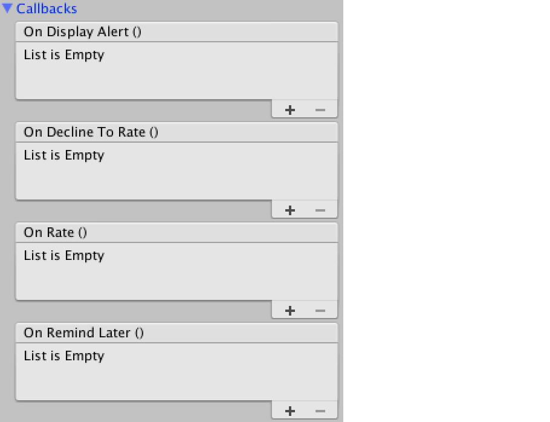

# Review 插件文档

更多的信息，请访问我们的主页：[www.sdkbox.com](http://cocos2d-x.org/sdkbox)

**<h2>给 SDKBOX IAP 1.3.7 之前版本用户的重要提示</h2>**
如果您已经安装使用了 SDKBOX IAP 1.3.6 或者更早版本的 IAP 插件，您在使用其他SDKBOX 插件之前需要升级 IAP 版本到 1.3.7 或者删除 Assets/IAP 目录。

## 集成 SDKBOX Review

首先将 ```sdkbox_review``` unity 包导入您的工程中。这将会在 Assets 目录下创建两个目录（Plugins 和 SDKBOX）。


在开始使用 Review 之前，在 Assets/SDKBOX/review 目录下找到 Review prefab 。


在您想使用 Review package 的场景中创建一个 Review prefab 的实例。在任何时候，您只需要一个 prefab 的实例。

在 hierarchy 中选择 Review 游戏对象，并且在您的 inspector pane 中您可以配置这个对象并且定制 Review 对话框。

## 配置 Review 插件


<h3>Description of Fields</h3>
### 配置字段说明

IOS App Id

<h5>Day Limit</h5>

这个字段指定了在提示用户给 app 评分之前，该 app 需要等待的天数。

<h5>Launch Limit</h5>

这个字段指定了在提示用户给 app 评分之前，该 app 需要运行的次数。

<h5>User Event Limit</h5>

这个字段指定了在提示用户给 app 评分之前，需要触发的用户事件数目。当一个用户事件触发时，您可以通过调用 ```Review.UserDidSignificantEvent``` 方法来通知 Review 插件。

<h5>Day For Reminding</h5>

当用户选择了“稍后提醒我”时，这个字段指定了再次提醒用户的间隔天数。

<h5>Launch For Reminding</h5>

当用户选择了“稍后提醒我”时，这个字段指定了再次提醒用户时该 app 需要运行的次数。

<h5>Try Prompt When Init</h5>

这个字段如果设置为 true ，Review 插件将会在初始化的时候就显示评分对话框，一般来说，也就是在 app 启动的时候显示。

## 配置 Review 对话框


您可以配置 Review 插件对话框上的所有文本， 包括定制内容以及改变文本位置。

## 处理 Review 事件

您可以在 SocialShare 脚本 inspector pane 中找到 ```Callbacks``` 项， 然后单击 ```+``` 添加一个回调，并指定想要触发的对象及方法。



## Review API

```
void show(bool force);

void userDidSignificantEvent(bool canPromptForRating);

void setTitle(string title);

void setMessage(string message);

void setCancelButtonTitle(string cancelTitle);

void setRateButtonTitle(string rateTitle);

void setRateLaterButtonTitle(string rateLaterTitle);
```

## iOS 平台上额外的集成步骤
在一些低版本的 unity 中，在 SocialShare/Assets/Plugins/iOS 下的静态库文件不会被包含在 XCode 工程中。在这种情况下，您需要将它们移动到 Assets/Plugins/iOS 目录中或者手动添加它们到 XCode 工程中。
