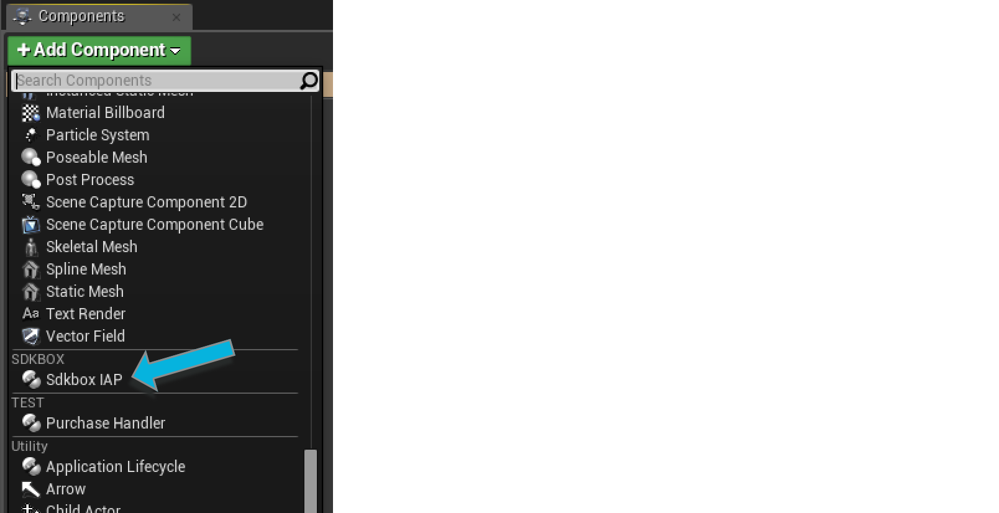
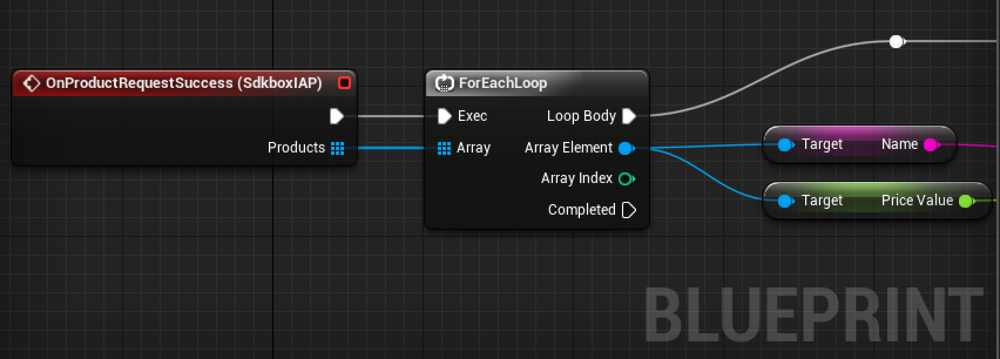

# IAP 插件文档

更多的信息，请访问我们的主页：[www.sdkbox.com](http://cocos2d-x.org/sdkbox)

## 为 IAP 插件配置您的虚幻4引擎工程

这部分文档不会包括如何创建工程，如何在 iOS 或者 Google 应用商店里创建 app 。关于这些方面的内容，请您参考 iOS 以及 Android 的相关文档。

The most important thing is setting the identifier used to identify the application in the Apple and Android store that you are going to buy from.
最重要的事是，配置标识符以从 Apple 或者 Android 平台应用商店区分应用程序。

对于 Apple 平台来说是包标识符，对于 Android 平台来说是 android 包名字。在 UE4 编辑器中访问项目属性并且在 iOS 和 Android 配置项下可以为这两项设置合适的值。

更多信息请参考相关平台的文档：
* [iOS 平台](https://developer.apple.com/library/ios/documentation/LanguagesUtilities/Conceptual/iTunesConnectInAppPurchase_Guide/Chapters/Introduction.html#//apple_ref/doc/uid/TP40013727)
* [Android 平台](http://developer.android.com/google/play/billing/billing_overview.html)

## 安装 UE4 SDKBOX IAP 插件

从 [SDKBOX UE4](http://unreal.sdkbox.com) 页面下载 SDKBOX IAP 插件。

### 在您的引擎中

1. 解压文件到 ```Engine/Plugins/SDKBOXIAP``` 下。
2. 执行引擎根目录下的脚本 GenerateProjectFiles 。
3. 打开您的引擎工程文件然后编译编辑器。

### 在您的项目代码中

1. 解压文件到您的项目目录 ```[Project Root]/Plugins``` 下。
2. 重新运行编辑器。将会提示您为编辑器编译这个插件。点击继续并且编译插件，然后再运行编辑器。

## 激活插件

如果您已经添加了插件到您的工程中，请依次点击 Settings -> Plugins 并向下滚动选中它。否则，这个插件将是内建工程的一部分。


确保 Enable 复选框被选中。您可能需要在这步之后重启编辑器。

## 初始化插件

确保尽可能早的调用 SDKBOX IAP 初始化方法，至少确保在调用任何其他方法之前调用它。您可以在您的游戏对象初始化的时候进行这个工作，或者在您的第一个场景播放事件中进行这个工作。

这个初始化方法有一个 JSON 字符串函数。您可以给它传递原始字符串，也可以在 Blueprint 编辑器中编辑购买项目描述并且在运行时生成字符串。

**重要提示：** 在 Android 平台下， 您需要提供 license key, 您可以从 Google Play 控制台中您的 App 下的 **Services & APIs** 配置项中找到 license key 。这点非常重要，因为 IAP 将不能在缺少它的情况下工作。这个 key 应该是传递的 JSON 字符串的一部分，您也可以通过编辑购买项目描述并且在运行时生成字符串的方式来把它加入到 JSON 字符串中。


在 Blueprint 编辑器中添加购买项目，首先您要添加一个类型为 ```SDKBox IAPProductDescription``` 的 ```Products``` 数组变量。

然后您可以在编辑器中单击 Products 添加购买项目。


名字是一个字符串值，在购买时您可以用它来标识一个购买项目。

ID 是一个标识符用于在商店里创建购买项目。

Consumable 类型的购买项目能够被购买多于一次，而 Non-Consumable 型的项目仅仅能够被购买一次。这两种类型的购买项目被所有平台支持。

You can have different Id's for each platform by specifying the Affinity for either iOS or Android. Specifying All will use the same details for all platforms.

您可以创建一个函数去把 Products 类型的变量转换成 JSON 字符串，然后把它用于传入初始化函数中（如上图所示）。

## 处理事件

在您的场景中，您可以使用把 SDKBOX IAP 组件添加到 actor 的方式来处理事件。



有8个事件您可以处理。


您可以单击 ```+``` 添加一个事件处理程序，用来在您的应用程序中实现 IAP 流程。


您总是能收到 ```OnInitialized``` 事件， 并且 ```Status``` 布尔参数用于表示初始化成功与否。

## 从商店中获取购买项目



如果初始化成功，您将收到 ```OnProductRequestSuccess``` 事件，它会提供一个数组参数来存储可购买项目信息（不要购买项目描述弄混，这是个相似的概念但含有的信息量较少）。

## 进行购买


### 处理购买成功及失败

您可以监听 ```OnSuccess，OnFailure 以及 OnCanceled``` 事件。这些事件的都会以正在购买的项目作为参数。


一些事件也会提供错误诊断信息用于判断诊断错误。


### 恢复购买项目

简单的调用 restore 方法，就可以恢复之前的购买项目。


This will send you a ```OnRestored``` event for each product that has been restored, and finally it will send a ```OnRestoreComplete``` event to signal that all products have been restored. Note that it is possible to receive only the complete event in the case where you have no previously purchased products.


<h3>Verify In App Purchase Receipt</h3>
### 校验购买收据

收据信息不会被默认发送， 您需要如下图所示，打开收据校验功能。


在 onSuccess 事件中为 IAP 收据数据检查 product.receipt 以及 product.receiptCipheredPayload的值。

提示： 只有 Google Play 提供收据数据，iOS 平台仅仅提供一个加密的内容字符串给用户去执行 IAP 校验。

# 代码参考

### SDKBOX IAP Functions

```
UCLASS(NotBlueprintable)
class USdkboxIAPFunctions
    : public UObject
{
	GENERATED_BODY()

public:

	UFUNCTION(BlueprintCallable, meta = (Keywords = "SDKBOX iap"), Category = "SDKBOX")
	static void SdkboxIapInitialize(FString jsonstring);

    UFUNCTION(BlueprintCallable, meta = (Keywords = "SDKBOX iap"), Category = "SDKBOX")
    static void SdkboxIapShutdown();

	UFUNCTION(BlueprintCallable, meta = (Keywords = "SDKBOX iap"), Category = "SDKBOX")
	static void SdkboxIapPurchase(FString product);

	UFUNCTION(BlueprintCallable, meta = (Keywords = "SDKBOX iap"), Category = "SDKBOX")
	static void SdkboxIapRefresh();

	UFUNCTION(BlueprintCallable, meta = (Keywords = "SDKBOX iap"), Category = "SDKBOX")
	static void SdkboxIapRestore();

    UFUNCTION(BlueprintCallable, meta = (Keywords = "SDKBOX iap"), Category = "SDKBOX")
	static FString SdkboxIapJsonStringFromProductDescriptions(const TArray<FSdkboxIAPProductDescription>& Descriptions);

    UFUNCTION(BlueprintCallable, meta = (Keywords = "SDKBOX iap"), Category = "SDKBOX")
    static void SdkboxIapEnableUserSideVerification(bool enable);
};
```

### SDKbOX IAP Product

```
UCLASS(ClassGroup=SDKBOX, HideCategories=(Activation, "Components|Activation", Collision), meta=(BlueprintSpawnableComponent))
class USdkboxIAPProduct
    : public UObject
{
	GENERATED_BODY()

public:

	USdkboxIAPProduct(const FObjectInitializer& ObjectInitializer);

    static USdkboxIAPProduct* ProductFromSdkboxProduct(const sdkbox::Product& product);

    // The name of the product
    UPROPERTY(BlueprintReadOnly, Category=General, meta=(DisplayName="Name"))
    FString Name;

    // The product id of an In App Purchase
    UPROPERTY(BlueprintReadOnly, Category=General, meta=(DisplayName="Id"))
    FString Id;

    // Type of iap item true if consumable
    UPROPERTY(BlueprintReadOnly, Category=General, meta=(DisplayName="Consumable"))
    bool Consumable;

    // The title of the IAP item
    UPROPERTY(BlueprintReadOnly, Category=General, meta=(DisplayName="Title"))
    FString Title;

    // The description of the IAP item
    UPROPERTY(BlueprintReadOnly, Category=General, meta=(DisplayName="Description"))
    FString Description;

    // Price value in float
    UPROPERTY(BlueprintReadOnly, Category=General, meta=(DisplayName="PriceValue"))
    float PriceValue;

    // Localized price
    UPROPERTY(BlueprintReadOnly, Category=General, meta=(DisplayName="Price"))
    FString Price;

    // price currency code
    UPROPERTY(BlueprintReadOnly, Category=General, meta=(DisplayName="CurrencyCode"))
    FString CurrencyCode;

    // cyphered payload
    UPROPERTY(BlueprintReadOnly, Category=General, meta=(DisplayName="ReceiptCipheredPayload"))
    FString ReceiptCipheredPayload;

    // receipt info. will be empty string for iOS
    UPROPERTY(BlueprintReadOnly, Category=General, meta=(DisplayName="Receipt"))
    FString Receipt;
};
```

<h3>SDKBOX IAP Product Description</h3>

```
UENUM(BlueprintType)
enum class EProductAffinityEnum : uint8
{
    PAE_ALL     UMETA(DisplayName="All"),
    PAE_IOS     UMETA(DisplayName="iOS"),
	PAE_ANDROID UMETA(DisplayName="Android")
};

USTRUCT(BlueprintType)
struct FSdkboxIAPProductDescription
{
    GENERATED_USTRUCT_BODY()

    // The name of the product
    UPROPERTY(EditAnywhere, BlueprintReadWrite, Category=General, meta=(DisplayName="Name"))
    FString Name;

    // The product id of an In App Purchase
    UPROPERTY(EditAnywhere, BlueprintReadWrite, Category=General, meta=(DisplayName="Id"))
    FString Id;

    // Type of iap item true if consumable
    UPROPERTY(EditAnywhere, BlueprintReadWrite, Category=General, meta=(DisplayName="Consumable"))
    bool Consumable;

    // Which platform this product description is for
    UPROPERTY(EditAnywhere, BlueprintReadWrite, Category=General, meta=(DisplayName="Affinity"))
    EProductAffinityEnum Affinity;
};
```

### JSON 配置

Here is an example of the JSON configuration. You will need to replace <put the product id for ios here> with the product id from your iTunes Connect or replace <put your googleplay key here> from your Google Play Console
这是一个 JSON 配置的样例。您需要用您的购买项目 ID 替换 <put the product id for ios here> 或者 替换 <put your googleplay key here> 。

```
"ios" :
{
    "iap":{
        "items":{
            "remove_ads":{
                "id":"<put the product id for ios here>"
            }
        }
    }
},
"android":
{
    "iap":{
        "key":"<put your googleplay key here>",
        "items":{
          "remove_ads":{
              "id":"<put the product id for android here>"
          }
        }
    }
}
```

如果您的购买项目是 non-consumable 类型的， 它也有必要添加到 JSON 配置中。只有 Android 平台下，需要这样做。用上面的 JSON 配置作为例子来说明这点：

```
"android":
{
    "iap":{
        "key":"<put your googleplay key here>",
        "items":{
          "remove_ads":{
              "id":"<put the product id for android here>",
              "type":"non_consumable"
          }
        }
    }
}
```

